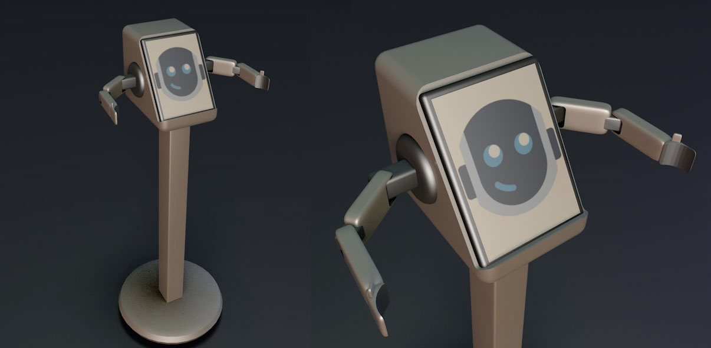
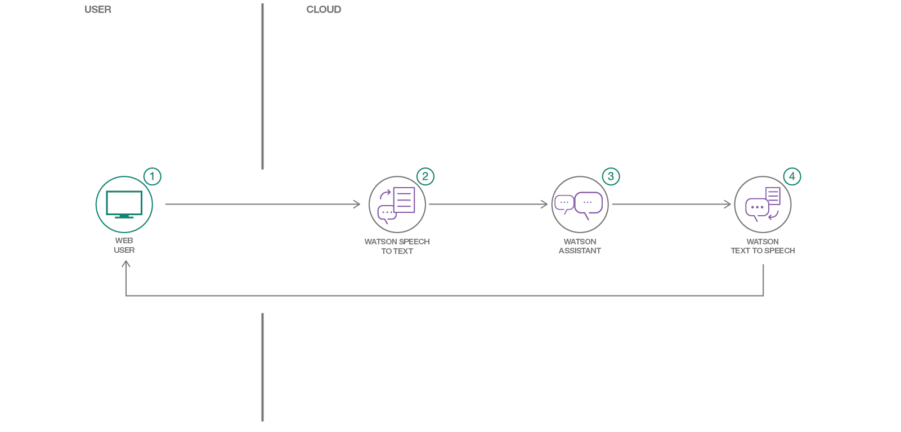
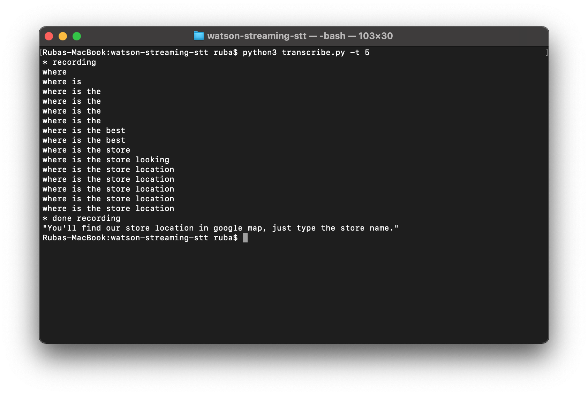

# ibm-watson-merge-stt-assistant-tts :sparkles:
* The purpose of this task is to **merge** an STT, Watson assistant, and TTS by IBM Watson Services by python language for the (Evaluation robot from the **Smart Methods company** ). 

* There is a tutorial for setup the IBM Watson Services in my GitHub [Watson Assistant](https://github.com/Ruba-Yahya/Task3-Chatbot.git) and [IBM-Watson-STT-TTS](https://github.com/Ruba-Yahya/IBM-Watson-STT-TTS.git).
* I merged STT, Watson assistant and TTS in the transcribe.py file
  * output.txt **contains** the text from (speech-to-text) my speech.
  * tts_audio.mp3 **contains** the speech from (text-to-speech) assistant response.
  * skill-customer-service.json **contains** the assistant skill 
* The workflow 

The output should be like this
-------------------------------

Helpful resources
-----------------
* [IBM-STT-Doc](https://cloud.ibm.com/docs/speech-to-text/websockets.html#websockets)
* [IBM-Assistant-Doc](https://cloud.ibm.com/apidocs/assistant/assistant-v2?code=python)
* [IBM-TTS-Doc](https://cloud.ibm.com/apidocs/text-to-speech?code=python#getpronunciation)
